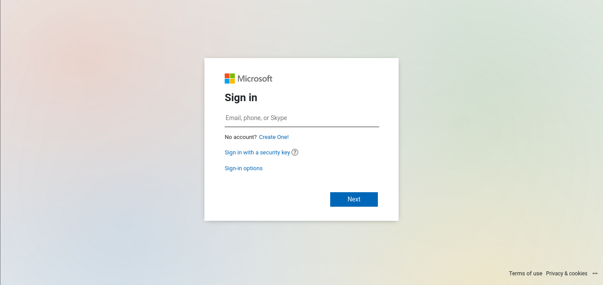
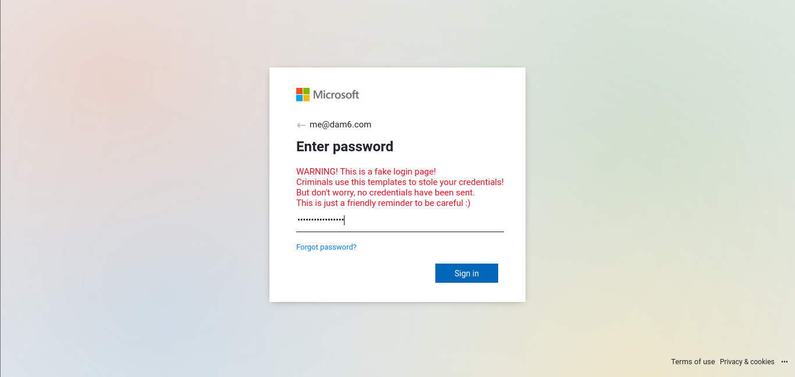

# Modern Microsoft login spoof template.

## About

This repo aims to provide a hands-on learning experience about cybersecurity, specifically focusing on the techniques used in creating and defending against spoofed login pages. This project is intended for educational purposes only and should not be used for any malicious activities.

## Screenshots

## Disclaimer

This repository contains code for a spoofed login page, which is created and shared solely for educational and ethical purposes. The goal of this project is to raise awareness about the dangers of phishing attacks and to help individuals understand how they work so that they can better protect themselves and their systems against such attacks.

## Usage

To use this code for educational purposes:

1. Clone this repository to your local machine.
2. Open the `index.html` file in a web browser to view the spoofed login page.

**Again, it is crucial to reiterate that this code should never be used for any malicious intent.**

## License

This project is licensed under the [MIT License](LICENSE). You are free to use, modify, and distribute the code for educational purposes, as long as you adhere to the terms outlined in the license.
